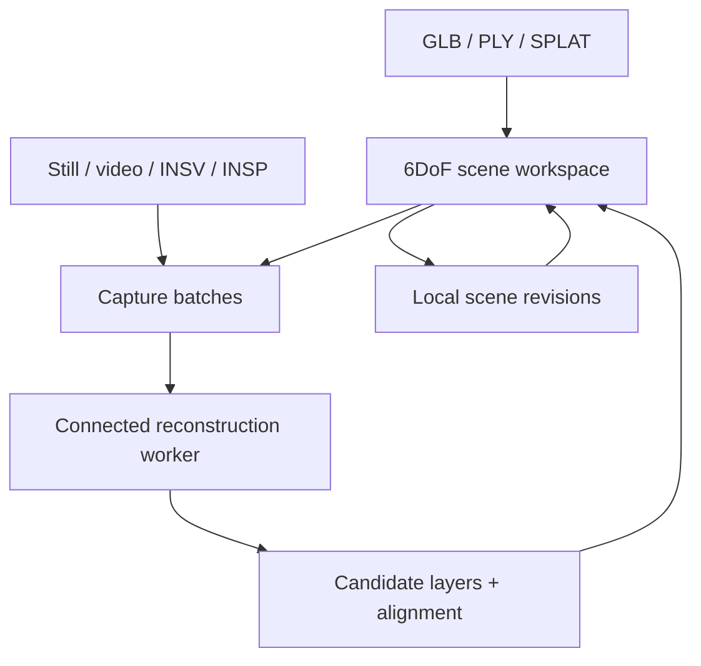
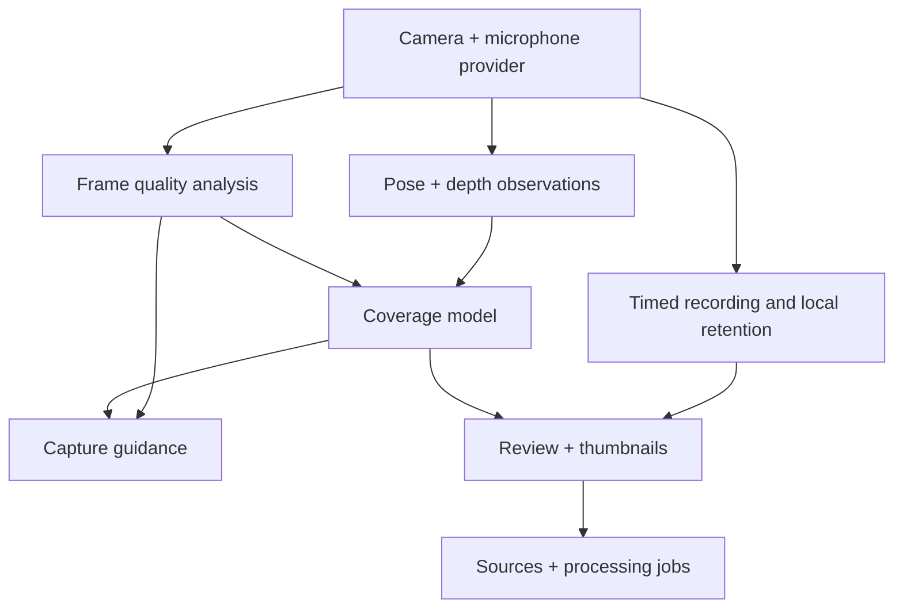

# Recruiser — Spatial Memory Cruiser

Architecture v0.1 · 2026-09-09 · APPROVED baseline. The guided-capture/audio proposal dated 2026-09-13 below is a separate, unsigned planning cycle.

## Decision to approve

Build a privately hosted Sites web/PWA workspace that opens GLB meshes, PLY meshes/point clouds/Gaussian splats and binary SPLAT assets in one 6DoF scene. Add ordinary and panoramic still/video capture batches, including original INSV/INSP from Insta360 Air, to a reconstruction queue grounded in an existing scene. A connected reconstruction worker returns candidate layers for review and acceptance. This release implements the viewer and complete worker-facing frontend; training a reconstruction model and implementing the native Insta360 decoder are outside this frontend release. Their absence must appear as a precise capability state, never simulated processing.

The Recruiser PDF supplies vignette, source, time, pose and anchor semantics. This task is the web review/reconstruction surface; it does not claim to implement the PDF's Quest object-finding MVP. Product name: Recruiser. Descriptive line: InferKnow for Space · just add Insta360 Air.

Only CHECKLIST.md is authored in this architecture phase, per Robin's project instruction. Architecture, contracts and the acceptance rubric are contained here. Attached CLAUDE.md requires explicit architecture consensus before implementation. On agreement, freeze this document before dispatching isolated implementation tasks. Admin-Manual I2 v0.2 (2026-09-13) supersedes the former coder-time halt/escalation rule: resolve concerns before checklist sign-off; execute the signed-off checklist autonomously through its goal and record later concerns in the completed handoff without reopening architecture. Form the rubric after architecture changes and before the next sign-off.

## Evidence and authority

- Read supplied Recruiser handoff PDF and supplied CLAUDE.md from local attachments.
- Read Admin-Manual README, MANUAL, ideology index and I0–I3 through the Robin-s-AI-World GitHub backup. Both discovered GitHub mirrors have identical README hashes. Forgejo remains authoritative; the live Forgejo version was not verified in this session.
- No project codegraph or Pieces tools were exposed. No existing Recruiser source was inspected or modified. This proposal is derived from the supplied requirements and handoff, not an assertion about an existing implementation.
- Three.js GLTFLoader: https://threejs.org/docs/pages/GLTFLoader.html
- Three.js PLYLoader: https://threejs.org/docs/pages/PLYLoader.html
- Spark scene integration: https://sparkjs.dev/docs/overview/
- Spark splat rendering: https://sparkjs.dev/docs/splat-mesh/
- No sample INSV/INSP files, existing GLB/PLY scene, worker endpoint or worker implementation was supplied. Raw-format decoding compatibility remains unverified until exercised with representative files and an advertised decoder.

## Architecture

Use the Sites Vinext starter, React/TypeScript UI, Three.js for meshes/points and Spark for Gaussian rendering, with locally bundled dependencies. Keep browser persistence and reconstruction transport in independent modules. No app-owned login or billing in this release. Sites access control supplies private publication. Preserve an exportable source checkout; no GitHub-hosted Actions workflow.

The browser owns visualization, local source retention, scene composition, candidate review and revision history. The worker owns original-container decoding, lens calibration, stitching, frame selection, pose recovery, registration and mesh/splat reconstruction. A hosted worker needs a browser-accessible HTTPS endpoint with CORS. An inaccessible LAN worker is a connection error; the hosted site cannot directly access an arbitrary local filesystem or assume its localhost is the user's machine.

## Frozen vocabulary and data conventions

- World frame: right-handed, +Y up, lengths in metres when scale is known. Unknown scale is explicitly `unknown`; it is never silently labelled metric. Import retains original coordinates. View-fit changes only the camera.
- Pose: position `[x,y,z]`, normalized quaternion `[x,y,z,w]`; layer scale is a positive uniform scalar. Export matrices are 16 finite column-major numbers. `T_WO = T_WC × T_CO` as in the handoff.
- Source: `{id, sha256, name, byteLength, mime, importedAt, captureTime:null|string, projection, lensProfile:null|string, blobKey}`. `projection` is `perspective`, `equirectangular`, `dual-fisheye`, `unknown`. INSV/INSP extension does not prove projection, stitching or decoder compatibility. File modification time is not capture time.
- Layer: `{id, sourceIds:string[], name, kind, blobKey, pose, scale, visible, provenance, alignment}`. `kind` is `mesh`, `points`, `gaussian`; alignment is `unregistered`, `manual`, `registered`. Provenance retains worker name/version, parameters and job ID when generated.
- SceneRevision: `{id, sceneId, parentRevisionId:null|string, worldFrameId, unitStatus, createdAt, layers:Layer[], vignetteIds:string[]}`. A scene has one current revision pointer. Revisions are immutable snapshots; restoring creates a new revision referencing the restored content.
- Vignette: `{id, sceneId, sourceIds:string[], startTime:null|string, endTime:null|string, title}`. Repeated capture occurrences retain separate IDs even when bytes match.
- Job states: `draft`, `awaiting-worker`, `uploading`, `queued`, `decoding`, `registering`, `reconstructing`, `review`, `accepted`, `rejected`, `failed`, `cancelled`. Transport retries reuse the same idempotency key. A deliberate new submission creates a new key.
- Candidate: `{id, jobId, baseRevisionId, layers:Layer[], alignmentScore:null|number, alignmentMethod, warnings:string[]}`. Alignment scores are reported worker estimates, not certified accuracy. Stale-base candidates cannot overwrite the current scene.
- Export: ZIP containing `scene.json` with schemaVersion `1`, source and layer byte assets, and their hashes. Import validates paths, declared sizes and references before an atomic write. Export preserves splats as splats; no claim that GLB contains the complete Gaussian scene.

## Worker contract v1

The frontend implements this explicit integration contract. It is a proposed adapter API, not a claim that an existing service implements it.

1. `GET /v1/capabilities` returns `{apiVersion:1, worker:{name,version}, inputs:[{extension,projections,lensProfiles}], outputs:["glb","ply-gaussian"], maxFileBytes, supportsCancellation:true|false}`. Missing formats disable submission for the affected sources and name the missing capability. Do not silently export or transcode raw media.
2. `PUT /v1/assets/{sha256}` streams original file bytes with Content-Type `application/octet-stream`; response `{assetId,sha256,byteLength}`. Repeating the PUT is idempotent. Retain source occurrences separately from transport content addressing. Verify acknowledgement hash/size. Exceeding worker size limits fails before upload.
3. `POST /v1/jobs`, header `Idempotency-Key`, JSON `{apiVersion:1,sceneId,baseRevisionId,worldFrameId,unitStatus,baseLayers:[{assetId,kind,pose,scale}],sources:[{assetId,sourceId,projection,lensProfile,captureTime}],output:"glb"|"ply-gaussian",frameSamplingSeconds:number}`. Response `{jobId,state}`. Positive frame sampling; stills ignore the sampling interval. Backend must accept the full grounding scene metadata; no automatic flattening of splats to meshes.
4. `GET /v1/jobs/{jobId}` returns `{jobId,state,progress:null|number,message,candidate:null|{id,baseRevisionId,alignmentScore,alignmentMethod,warnings,outputs:[{assetId,name,format,pose,scale,sourceIds}]}}`. Poll every two seconds while visible, ten seconds while hidden; abort on teardown. Progress is the reported value, never an animation representing fake work.
5. `GET /v1/assets/{assetId}` downloads generated bytes. Only worker-origin asset paths are accepted. Validate returned geometry before adding it to the candidate group.
6. `POST /v1/jobs/{jobId}/cancel` when advertised. Local polling cancellation does not falsely assert remote compute cancellation. Network errors retain job IDs for reconnection. 401/403 requests reauthentication, 413 identifies oversized input, 422 shows decode/calibration/alignment rejection, 429 honours Retry-After, 5xx offers an idempotent retry.

An optional operator-supplied bearer credential is held in browser session memory only. No provider secret is bundled, written to localStorage, embedded in exports or copied into this app's repository. Managed worker secrets resolve from Admin-Manual-backed environment variables on the worker side. No credentials need to be retrieved to build the local viewer.

## Independently implementable task packets

Dates below are proposed planning windows, not elapsed-time promises. Each packet owns disjoint product files. The Sites owner performs scaffold, dependency installation, identity registration and publication; no subagent invokes Sites lifecycle tools. Contract-compatible test doubles belong only in tests. Other task completion never blocks authoring an individual packet. Resolve missing contract detail before sign-off; record concerns discovered during implementation for the completed handoff while continuing the approved execution.

- [X] **T1 — Build the scene renderer** — @viewer-coder — Due: 2026-09-16

  Files-you-may-touch: `components/recruiser/SceneViewport.tsx`, `lib/recruiser/render.ts`, `tests/recruiser/render.test.ts`.

  Do: Export `SceneViewport({layers,candidateLayers,onLayerError,onPoseChange})`; layer input is `{id,name,kind:"mesh"|"points"|"gaussian",file:Blob,position:[number,number,number],quaternion:[number,number,number,number],scale:number,visible:boolean}`. Load GLB with Three.js GLTFLoader, PLY with PLYLoader for meshes/points, Gaussian PLY and SPLAT with Spark. Inspect PLY header properties, not its filename: faces indicate mesh; standard scale/rotation/opacity Gaussian fields indicate Gaussian; ordinary vertices indicate points. Unknown compressed schemas produce a named unsupported-format error rather than a point-cloud fallback. Route explicit `.splat` assets to Spark. Bundle GLB compression decoders required by the chosen loader configuration. Catch each layer failure without removing previously loaded layers. Provide orbit and free-flight modes: W/S forward/back, A/D strafe, R/F up/down, drag to look, Q/E roll, Shift speed multiplier, Escape releases input, Home fits visible bounds. Ignore shortcuts in editable controls. Touch controls expose movement and pitch/yaw/roll. Preserve transforms when adding layers. Resize with container dimensions; dispose geometries/materials/textures/blob URLs and renderer resources on removal. Export camera pose through onPoseChange; onLayerError returns `{id,message}`.

  Verify: meaningful fixtures exercise binary/ASCII PLY points, PLY triangles, Gaussian PLY, GLB and malformed input. Verify matrix composition and that fit does not mutate geometry. Interaction rubric includes independent translation and roll, visibility and candidate overlays.

  Accept: mesh, points and Gaussian layers coexist with independent transforms; malformed files do not destroy the scene; navigation has all six degrees of freedom. No raster mockup masquerades as a rendered scene.

- [X] **T2 — Preserve captures and scene revisions** — @persistence-coder — Due: 2026-09-16

  Files-you-may-touch: `lib/recruiser/storage.ts`, `lib/recruiser/archive.ts`, `tests/recruiser/storage.test.ts`.

  Do: Export `openStore()`, returning async `putBlob(blob):{blobKey,sha256,byteLength}`, `getBlob(blobKey):Blob`, `appendRevision(sceneId,expectedHead,revision):revisionId`, `getScene(sceneId)`, `listScenes()`, `saveSource(source)`, `saveJob(job)`, `getJobs(sceneId)`. Store versioned JSON records and byte assets in IndexedDB; IDs are UUIDs and byte keys are SHA-256. Distinct source occurrences survive repeated identical bytes. Revision JSON is `{id,sceneId,parentRevisionId,worldFrameId,unitStatus:"metres"|"unknown",createdAt,layers:unknown[],vignetteIds:string[]}`; validate JSON structure and finite transforms before writes. Use one transaction to check expectedHead and advance the scene pointer; mismatch returns `REVISION_CONFLICT`. Keep all old revisions and assets. Export `exportProject(sceneId):Blob` and `importProject(zip:Blob):{sceneId}`; ZIP has schemaVersion 1 scene.json and relative asset paths with byte counts and hashes. Reject traversal, missing assets, invalid hashes and uncompressed totals above 2 GiB before import. Never overwrite an existing project on import: issue a new scene ID and retain imported provenance. Quota failure reports insufficient local storage without advancing the head; session data remains downloadable. Request persistent browser storage and display whether granted through getScene metadata.

  Verify: restore round-trip retains source bytes, Gaussian bytes and poses; simulate interrupted writes, quota failure, bad ZIP hashes and two concurrent head updates. Reapplying a revision ID has no duplicate effect.

  Accept: refresh recovers saved scenes and jobs; rejection or restoration never destroys prior scene history; exported project remains usable without the hosted service.

- [X] **T3 — Implement original-media ingest and job transport** — @ingest-coder — Due: 2026-09-16

  Files-you-may-touch: `lib/recruiser/ingest.ts`, `lib/recruiser/worker-client.ts`, `tests/recruiser/worker-client.test.ts`.

  Do: Export `inspectMedia(file:File):Promise<{name,byteLength,mime,projection:"perspective"|"equirectangular"|"dual-fisheye"|"unknown",captureTime:null|string,previewUrl:null|string,requiresWorker:boolean}>`. Accept jpg/jpeg/png/webp/heic/heif/avif, mp4/mov/webm, insv/insp; report browser preview failure while retaining original bytes. Never infer equirectangular solely from 2:1 dimensions; use that as a suggestion requiring explicit projection selection. Export `createWorkerClient({baseUrl,bearerToken,onStatus})` with async `capabilities()`, `upload(file,sha256)`, `submit(payload,idempotencyKey)`, `status(jobId)`, `asset(assetId)`, `cancel(jobId)`. Implement GET /v1/capabilities, PUT /v1/assets/{sha256}, POST /v1/jobs with Idempotency-Key, GET /v1/jobs/{jobId}, GET /v1/assets/{assetId}, POST /v1/jobs/{jobId}/cancel. Capability body is `{apiVersion:1,worker:{name,version},inputs:[{extension,projections,lensProfiles}],outputs:string[],maxFileBytes,supportsCancellation}`. Submission forwards `{apiVersion:1,sceneId,baseRevisionId,worldFrameId,unitStatus,baseLayers:[{assetId,kind,pose,scale}],sources:[{assetId,sourceId,projection,lensProfile,captureTime}],output,frameSamplingSeconds}` unchanged after validation. Polling state vocabulary: queued/decoding/registering/reconstructing/review/failed/cancelled; status contains reported progress/message and nullable candidate with outputs `{assetId,name,format,pose,scale,sourceIds}`. Candidate includes id, baseRevisionId, alignmentScore, alignmentMethod and warnings. Return typed failures for unreachable endpoint, incompatible API, unsupported camera profile, authentication, size, decode, alignment and server errors. Retry network/5xx uploads using the same hash; retry submission using the same key. Never auto-retry a new job. Hold credentials only in closure memory. Require HTTPS for hosted connections. Cancellation is effective only when acknowledged by the worker.

  Verify: contract tests cover capability rejection, preserved raw bytes, retry identity, real status transitions, stale candidate metadata and remote cancellation refusal. Tests use a local HTTP contract server; no fake worker is shipped.

  Accept: INSV/INSP is accepted as an original source without claiming browser decode; missing worker disables reconstruction with an actionable reason; the worker receives existing scene assets and transforms.

- [X] **T4 — Compose the workspace and incremental review** — @workspace-coder — Due: 2026-09-23

  Files-you-may-touch: `app/page.tsx`, `app/globals.css`, `components/recruiser/Workspace.tsx`, `components/recruiser/SourceQueue.tsx`, `components/recruiser/LayerInspector.tsx`, `components/recruiser/WorkerSettings.tsx`.

  Do: Design a dark graphite surveying workbench with cyan selection, amber unregistered-state accents, central viewport, left scene/layer list, right ingest/review inspector and lower source strip. Start directly in the workspace. Use installed Shadcn primitives for dialog, select, slider, tabs, switch, tooltip and feedback. Desktop panels collapse into sheets on mobile. Provide File/Edit/View/Help menus and About in File and Help; light/dark/system appearance and Kinetic, Brutalist, Retro, Neumorphism, Glassmorphism, Y2K, Cyberpunk, Minimal theme choices. Show version v0.1 and an epoch-minute build identifier in About and bottom-right; Copyright (C) 2025-2026 Robin L. M. Cheung, MBA. All rights reserved.

  Local integration contract: SceneViewport receives `{layers,candidateLayers,onLayerError,onPoseChange}`, each render layer `{id,name,kind,file:Blob,position,quaternion,scale,visible}`. Storage openStore returns putBlob/getBlob/appendRevision/getScene/listScenes/saveSource/saveJob/getJobs; archive exports exportProject/importProject. Ingest inspectMedia returns `{name,byteLength,mime,projection,captureTime,previewUrl,requiresWorker}`. Worker createWorkerClient returns capabilities/upload/submit/status/asset/cancel. Implement these calls using the declared shapes, with test-only substitutes while sibling modules are absent. Keep source occurrences `{id,sha256,name,byteLength,mime,importedAt,captureTime,projection,lensProfile,blobKey}` and layers `{id,sourceIds,name,kind,blobKey,pose:{position,quaternion},scale,visible,provenance,alignment}`. Revisions contain sceneId/id/parentRevisionId/worldFrameId/unitStatus/createdAt/layers/vignetteIds.

  Allow opening a base scene, adding GLB/PLY/SPLAT layers, inspecting visibility/position/rotation/scale, choosing unit status, framing selection, queueing media and editing projection/lens profile. Raw sources remain visible even without preview. Worker UI sends selected original source assets and all grounding layers; output selection is GLB or Gaussian PLY. Persist a job before upload. Record vignette IDs and original capture timestamps without manufacturing missing metadata. Show candidate geometry separately with before/after toggle and worker alignment report. Accept creates a new revision atomically only if its base remains the current head; stale candidates require rerunning against the current revision. Reject retains source/job records and leaves the scene unchanged. Manual additions are labelled unregistered until the user records a manual alignment. No automatic spatial registration claim from merely loading files. Keep panorama previews labelled as images: a sphere preview provides rotational viewing, not reconstructed translation.

  Verify: rubric scenarios include first-open empty state, mixed drop batch, worker absent, per-file decode failure, repeated submit, a candidate returned against a changed head, accepted addition, rejection, history restoration, reload and project export. Assess readable controls at 200% text scale and narrow mobile layout when browser QA is authorized.

  Accept: the complete frontend is usable without a worker for local viewing and manual assembly. Reconstruction actions communicate their actual capability. Scene provenance and revision semantics remain visible and accurate.

- [/] **T5 — Assemble, package and privately publish** — @sites-owner — Due: 2026-09-23

  Files-you-may-touch: Sites scaffold files, `package.json`, `package-lock.json`, `.openai/hosting.json`, `app/layout.tsx`, `app/manifest.ts`, `public/sw.js`, `public/icons/icon-192.png`, `public/icons/icon-512.png`, `lib/recruiser/build-info.ts`. Preserve all product files owned by T1–T4; a defect is returned to the responsible task.

  Do: After architecture agreement, initialize one Sites checkout at /workspace/sites/recruiser using the supplied managed-linux Sites starter. Register once, retain the Site ID in hosting.json and preserve generated framework integration. Install compatible Three.js and Spark dependencies with exact resolved versions in the lockfile; no CDN runtime scripts. Build-info exports `{version:"0.1",build:string,copyright:string}` with build equal to floor(epochSeconds/60) modulo 100000, zero-padded to five digits; copyright is Copyright (C) 2025-2026 Robin L. M. Cheung, MBA. All rights reserved. Supply a PWA manifest with standalone display, proper 192/512 icons, and service worker caching same-origin app shell and immutable renderer assets after first successful load. Do not cache credentials, worker jobs or source media in the service worker. Browser media persists only in IndexedDB. No hosted heavy-compute pipeline and no automatic GitHub Actions workflow. Read Sites hosting instructions, build locally, save the source version and privately deploy. Verify terminal deployment status and return its URL. Never publish Admin-Manual contents, raw user capture files or credentials as site assets.

  Verify: production build, dependency compatibility, install manifest and service worker paths, static decoder/worker asset packaging, successful Sites deployment status. Report which runtime scenarios lack fixtures or browser verification. Do not equate a green build with proven reconstruction.

  Accept: privately accessible deploy of the finished viewer/frontend, preserved source, truthful limitations, no unsupported feature reported as tested. Native Quest capture and actual reconstruction-worker implementation are not represented as delivered.

## Acceptance rubric — formed after the architecture above

| ID | Observable evidence required | Failure interpretation |
|---|---|---|
| R1 | GLB, PLY mesh, PLY points and Gaussian PLY display as their true representations | Incorrect representation or loader defect |
| R2 | Independent XYZ movement and pitch/yaw/roll change the camera; imported geometry coordinates remain unchanged | 6DoF or frame-policy defect |
| R3 | A second geometry layer retains its transform and can be hidden independently | Composition defect |
| R4 | Original INSV/INSP bytes survive import/export; missing profile/decoder is explicitly reported | Raw ingest or capability honesty defect |
| R5 | Regular/equirectangular still/video have distinct selectable projection metadata and honest preview states | Ingest semantics defect |
| R6 | Worker receives original inputs plus base revision, world frame and grounding geometry | Incremental reconstruction contract defect |
| R7 | Preview/accept/reject modifies only the intended revision; stale candidate cannot overwrite head | Data integrity defect |
| R8 | Retry retains job identity; repeated capture occurrences retain their own provenance | Idempotence/provenance defect |
| R9 | Refresh and ZIP round-trip preserve assets, poses and revision history; quota failure preserves current head | Persistence defect |
| R10 | PWA shell opens after cached load with worker disconnected; worker capability loss leaves local viewer usable | Portability defect |
| R11 | Deployment has terminal success and source is retained; no unperformed browser/decoder checks claimed | Delivery/evidence defect |

## Current handoff

- [X] Architecture proposal and rubric prepared from the supplied requirements and handoff.
- ✅ Robin approved the architecture and frontend/worker boundary on 2026-09-09; use GitHub mirror while Forgejo is down and proceed on raw-format specifications pending samples.
- ✅ Architecture frozen following approval; T1–T4 implemented. TypeScript checks and five targeted tests passed. Production build passed. Private publication in progress.
- [ ] Representative raw Air files and a reachable worker are needed to verify actual decoding and reconstruction; frontend and standalone viewer construction do not wait for them after architecture agreement.

Pieces consulted: unavailable. Existing project codegraph consulted: unavailable. No secrets read or modified. This file is the sole architecture artifact for this turn.

## Implementation evidence — 2026-09-09

- `node --import tsx --test tests/recruiser/*.test.ts`: 5 passing tests (PLY variants, GLB geometry, immutable revisions/archive, corrupt archives, worker HTTP retry/cancellation contract).
- `npx tsc --noEmit`: passed. Production Vinext build: passed.
- Browser/GPU execution, PWA installation/offline behavior, actual INSP/INSV decoding and real-worker end-to-end reconstruction have not been exercised. No browser QA was requested.
- Renderer dependencies resolved to the exact installed versions in package-lock.json. Spark is loaded on demand for Gaussian layers.
- The initial `tsx` CLI hit a restricted IPC socket; Node with the tsx import loader successfully ran the unchanged test suite, including its local HTTP server.

## Authorized workspace update — 2026-09-11

Robin requested mouse-wheel 6DoF flight, manual cursor-key layer nudging and upside-down correction, composite export guidance, diagnosis of an audio-only source preview, a Home icon to avoid confusing view-fit with screenshot capture, and actual PNG screenshot / fly-through recording controls. These extend the approved frontend without changing immutable revisions or worker API v1. Optional source preview fields reference an additional preserved blob, while reconstruction continues to use the original. ZIP export/import retain and validate that extra reference.

- ✅ Camera gesture module: wheel translation, Ctrl/Meta lens zoom, Shift strafe, Alt lift, Ctrl/Meta+Shift roll; left-drag look and right-drag pan. Camera-only operations leave geometry unchanged. Tested orientation-relative travel and modifier separation.
- ✅ Layer transform math: immutable world-axis translation/rotation; explicit X/Z 180° flips. Tested Y/Z inversion with X flip. UI preview is transient; Apply records one revision, Cancel restores saved pose, export requires the draft to be resolved. Browser interaction not yet exercised.
- ✅ Combined GLB and Gaussian PLY serialization: parse round-trip tests establish composition transforms, original material immutability, splat counts and scale/quaternion/opacity encoding. GLB includes visible mesh/point layers only, and Gaussian PLY visible Gaussian layers only. Mixed-representation archive remains unchanged.
- [X] Capture preview reserves video space, attempts native container decoding and reports no decoded picture. The subsequently supplied MP4 is valid HEVC Main 10, 10-bit 4:2:0, BT.2020/PQ HDR with AAC. It decodes locally; browser codec availability remains environment-dependent. An H.264 8-bit BT.709 SDR preview copy was converted and fully decoded, and can be attached to the original capture. Archive tests verify both blobs survive. Original download is available.
- [X] Source UI wording identifies the current preview operation without implying panorama depth inference is impossible. Air-inspired scope is retained with general camera inputs.
- [ ] Actual browser/GPU playback, compressed-texture export and Quest execution remain unverified; no browser QA was requested.

- [X] Viewport PNG screenshot and silent fly-through recording via feature-detected captureStream/MediaRecorder, timer, stop/download, 512 MiB cap, and stream-track cleanup. A fixed-size recording canvas handles viewport resize by letterboxing; recording stops on tab hiding or graphics context loss. These record the perspective viewport, not stereo/spherical output. Browser recording is unverified.

Nine targeted tests passed. Source is checked with TypeScript and the Sites production build before saving. No Pieces tools are available.

### Follow-up capabilities discussed, not implemented in this update

- Geographic placement: the INSP sample has location in its camera trailer; conventional EXIF is incomplete. GPS extraction, timed video telemetry and a fixed geographic origin require explicit source schema/worker work. Use COLMAP pose priors and sequential/spatial matching with uncertainty; retain source calibration and timestamps. See https://colmap.github.io/faq.html#reconstruction-with-pose-priors-gps and https://developers.google.com/streetview/publish/camm-spec .
- Automatic scan registration is distinct from saving a combined file. It can use geometric overlap and/or the registered source-camera dataset, then surface/splat refinement. Current UI still requires a compatible reconstruction worker for automated processing.
- Single panorama inference: DA360 produces scale-invariant depth and point clouds; BLUNT can convert a panorama to a standard Gaussian PLY with DA360; Pano2Room generates occluded indoor surfaces. See https://github.com/Insta360-Research-Team/DA360 , https://github.com/SonnyC56/blunt , https://github.com/TrickyGo/Pano2Room . These have not been installed/run here; model licenses and output scale need evaluation before integration.
- Photorealistic finish: LichtFeld Studio can initialize from existing splats and train against a unified registered image dataset; SuperSplat provides cleanup. See https://github.com/MrNeRF/LichtFeld-Studio/wiki/Command-Line-Options and https://github.com/playcanvas/supersplat . No trainer was integrated or run this turn.

## Requested recovery and cleanup update — 2026-09-11

- [X] Removable scene layers and capture sources with item Undo and history restore. Removed capture IDs live in immutable revisions; original evidence is retained. ZIP remaps removal references when importing a fresh scene. Worker API stays unchanged.
- [X] Reset to first saved layer pose and previous saved alignment, following revision ancestry rather than timestamps. Reset previews before Apply. Loader inspection still finds no format-wide GLB inversion; affected user geometry has not been supplied, so its actual orientation cause is unresolved.
- [X] Prepared download dialog shared by ZIP/composite export, PNG and recording. Explicit link, supported native file picker/share, and conditional save-tab Blob transfer. Prepared files queue rather than replacing an export when recording stops. Exact origin/window/session validation and timeout; no uploads or assumptions of shared browser storage.
- [X] WebGL2 startup retries a browser-selected/low-power device, offers Retry graphics, and explicitly releases contexts on disposal. Requires a functioning browser GPU stack.
- [X] Focused tests cover alignment ancestry and metadata retention, tolerant quaternion comparison, removal → archive/import → restoration with original evidence, and rejected foreign handoff messages.
- [ ] Browser download/popup behavior and actual GPU recovery have not been exercised. No browser QA requested. Live publication is separate from saving this update.

## INSP preview and mobile next action — 2026-09-12

Frozen repair contract under the approved frontend/worker boundary. User supplied three Insta360 Air INSP photos and a Z Fold 5 screenshot showing blank cards and no apparent next action. All three files contain decodable JPEG bytes from offset zero (3008 × 1504), followed by camera metadata; they are dual fisheye, despite the 2:1 ratio. Supplied photos remain private diagnostic inputs outside the source checkout. The read-only source report identifies an unconditional raw-file thumbnail exclusion and a reconstruction form available only in a hidden mobile side panel. Codegraph and Pieces are unavailable; the explicitly bounded source/interface report is the recorded diagnostic input. No worker endpoint is supplied. This repair does not implement reconstruction, change worker API v1, or permit empty-base reconstruction.

- [X] **P1 — Decode available INSP photo previews** — @sites-owner — Due: 2026-09-12

  Files-you-may-touch: `lib/recruiser/ingest.ts`, `components/recruiser/SourceQueue.tsx`, `components/recruiser/CapturePreview.tsx`, `tests/recruiser/ingest.test.ts`. Read-only inputs: `lib/recruiser/storage.ts` and the three supplied files under `../upload/`.

  Do: Add exported `prepareMediaPreview(blob:Blob,name:string):Promise<{blob:Blob,mime:string,kind:"image"|"video"|"unsupported"}>`. Read a bounded header, recognize JPEG SOI independently of filename/MIME, return a JPEG-typed slice retaining all original bytes; retain existing image/video MIME and MP4 container sniff support. Unknown raw bytes return unsupported. Use this shared classifier for ingest, queue thumbnails and preview dialog; remove unconditional INSP exclusion. Retain original source and upload bytes. Verify browser decode using existing load/error pathways with timeout and cancellation cleanup. Thumbnails are bounded to 480 pixels on the longest edge and release decoded objects and object URLs; sequence queue thumbnail decodes to limit mobile peak memory and keep effects cancellable. Never infer projection from dimensions. For original INSP, read only the last 4096 bytes for a valid trailer JSON; only the exact cameraType `air` and exportTime `0` combination assigns `dual-fisheye`. Otherwise retain unknown or explicit saved projection. Do not extract or expose GPS. Successful flat-preview copy says `Photo preview` / `Dual-fisheye photo` and explains stitching/3D processing separately; unsupported data shows an actionable preview failure. Saved raw photos are previewed through the same helper on reload without rewriting records solely for preview. Add visible Preview affordances on cards, preserve existing edit/remove/select behavior, and expose selection count plus Select all/Clear selection.

  Verify: Node tests use synthetic JPEG/MP4/unknown bytes to verify MIME recognition and byte preservation, bounded trailer detection, no 2:1 inference, and malformed-trailer handling. Exercise the exact supplied photos through the helper without committing them. TypeScript and existing regression suite remain valid. Browser execution is not claimed unless performed.

  Accept: decodable INSP bytes reach an image decoder in both thumbnail and full preview paths; unsupported preview does not discard original evidence; available picture pixels are not labelled as a stitched panorama or reconstructed scene.

- [X] **P2 — Expose the next action beside captures on every screen** — @sites-owner — Due: 2026-09-12

  Files-you-may-touch: `components/recruiser/Workspace.tsx`, `components/recruiser/SourceQueue.tsx`, `components/recruiser/WorkerSettings.tsx`, `app/globals.css`. Read-only inputs: `lib/recruiser/storage.ts`, `lib/recruiser/worker-client.ts`, `components/recruiser/LayerInspector.tsx`, `components/ui/button.tsx`, `components/ui/sheet.tsx`, `components/ui/dialog.tsx`.

  Do: Extend SourceQueue with explicit next-action label, hint, disabled state and callback plus a bulk selection callback; Workspace owns derived state. Keep an always-visible action area outside the horizontally scrolling cards. With no captures: `Add photos or videos` opens existing capture picker. With captures and no selection: `Select all captures` selects visible captures. With selected captures and no connected worker: `Set up 3D processing` opens processing settings; adjacent copy explicitly says files are saved on this device and 3D processing needs a connected service. With connected worker but no base layers: `Open a base scene` invokes existing scene picker and explains incremental reconstruction requires a base GLB/PLY/SPLAT. With a base and captures: `Review & submit` opens the existing processing form, including capability corrections. The real submit button is labelled `Submit N captures` and retains all existing capability, busy, active-job, idempotency, grounding and candidate safeguards. A running job leads to `View processing`; import/submission busy state prevents duplicate action. New uploads are selected as before. Existing saved selections remain explicit; restored sources offer Select all without requiring individual card checks.

  The processing panel has visible mobile entry text, a concise selection summary and the exact missing requirement beside the submission control. Connection form uses `3D processing service` and `Connect service`, explains whether connected, and avoids implying the frontend already supplies compute. Opening setup focuses the service step; review opens ingest step. Successful connect returns a clear next instruction. Preserve endpoint validation, session-only token storage and existing access audience.

  Mobile: retain the graphite/cyan workbench, make the capture/action section auto-height, constrain only the card strip, keep tap targets at least 44px, let action labels/hints wrap, and use safe-area padding. Remove fixed mobile workbench minimums that force the main action out of reach. Size viewport against dynamic viewport height while keeping controls usable; do not hide the source action area with overflow. Narrow phones and unfolded Fold widths both expose a next action without finding an icon-only panel control. Preserve all existing renderer/export/layer functions.

  Verify: TypeScript check, targeted pure classification tests and existing regression suite, production build. Semantically review no-capture, raw-file preview, no-worker, no-base, no-selection, unsupported projection, active job and mobile layout branches. No real-worker or physical-device success is claimed.

  Accept: importing a capture shows what is ready, what remains and a reachable labelled next action; selecting files is never represented as submitted or reconstructed.

- ✅ **P3 — Verify and publish this repair** — @sites-owner — Due: 2026-09-12

  Files-you-may-touch: `CHECKLIST.md` evidence/status only and `lib/recruiser/build-info.ts` existing generated build identity. Build outputs remain governed by existing project scripts. Reuse project `appgprj_6aa119d173188191934ea9a2053e70a5` and its current public audience.

  Do: Preserve the prior source via the existing backup branch, commit/push frozen checklist before coding, implement P1/P2 without changing this contract, verify and record actual results, build/package/push exact source, save a version and deploy through Sites. Keep diagnostic photos and credentials outside the source and deployment. Under Admin-Manual I2 v0.2, resolve contract concerns before sign-off and record later concerns with evidence in the completed handoff while continuing approved execution.

  Verify/Accept: terminal successful deployment for exact committed source; report the deployed URL, INSP preview correction, next action, and requirement for a compatible reconstruction service. Mark physical Z Fold 5 and real-worker checks unperformed.

### Repair verification evidence — 2026-09-12

- Shared preview helper recognizes each of the three supplied INSP files as JPEG, identifies their nested `info.cameraType`/`info.exportTime` Air metadata, and preserves every byte. Independent native image decoding verified each original at 3008 × 1504. Personal images and their location metadata are excluded from source and deployment.
- All 17 Node regression tests passed, including five new media classification/projection tests. The five media tests passed again after the real sample revealed the nested trailer object. TypeScript passed after the final component changes.
- Read-only component review checked thumbnail serialization and resource cleanup, original asset preservation, source selection, submission prerequisites, active-job handling, and mobile action placement. It identified and corrected a portalled setup-dialog overflow issue, attached-preview mislabelling and a viewport minimum that would have clipped toolbar controls. Legacy unknown projection records retain their stored value; the preview explicitly tells the user which Projection choice to use when Air metadata is detected.
- The final reviewed Sites production build passed. Sites version 5, source `21dda9f2b1919fcdad9661df9e3748374b3d9568`, reached terminal `succeeded` at 2026-09-12T01:36:39.253225+00:00 at https://recruiser.robinc.chatgpt.site. This attests publication, not browser/device behavior.
- Browser rendering, physical Z Fold 5 interaction and real-worker reconstruction were not exercised. No compatible live reconstruction endpoint was supplied. No reconstruction backend, cloud upload of the diagnostic photos, GPS extraction or model run was added.

## User clarification — recognizable files in the capture list

Authority: Robin clarified “in the file shower” and “how do I know what I selected, which to remove,” after noting that FFmpeg can extract thumbnails and previews. He then broadened the scope to **any reference to any file or object**, specifying a still thumbnail for still content and an animated GIF-type thumbnail for video. He further specified animated 3D thumbnails using an orbit or changing viewing elevation, so the item and the extent of its captured coverage are recognizable. Capture Sources is one instance of this application-wide requirement. The assistant's intervening interpretation about orientation/parameter editing was incorrect.

This section supersedes acceptance of a permanent generic-format icon as sufficient preview support for a valid supported capture. It records the corrected product requirement; it does not claim a newly implemented decoder or conversion service.

Required behavior at every file/object reference:

1. Every photo reference displays the actual photograph inline. Every 3D object/layer reference displays a looping rendered orbit of that object. Frame the full geometry bounds, make a complete revolution around the object with a gentle elevation/tilt variation, and retain its saved orientation and appearance. The animation moves the thumbnail camera; it does not rotate, rescale or write back the object in the actual scene. The loop reveals spatial extent, sides, depth and missing surfaces so the user can judge identity and captured coverage. Every video reference displays a silent, automatically looping motion thumbnail with a video indicator and duration when available. The loop shows sampled content from across the recording so similar videos can be distinguished; a static poster is a loading frame, not the finished video thumbnail. “Animated GIF-type” specifies the visible looping behavior, not a mandatory GIF file encoding. Tap opens a larger image/object inspection or playable/scrubbable video preview. INSP/INSV filenames, camera icons and generic object cubes do not establish content identity.
2. Selection is visible on that same card using a check mark and the word `Selected`; the image remains recognizable. Show `N selected / M captures` and Select all / Clear selection. Selection is a choice for processing, not file removal.
3. Each card has a visible `Remove` action separate from preview and selection. Removing affects that source occurrence, updates the count and offers Undo under the existing immutable-history contract. Neither inspection nor checkbox changes remove the file.
4. Thumbnail preparation starts automatically when a file/object enters the workspace, including a single capture in an empty scene. It also runs for restored entries lacking a usable thumbnail. No base geometry, lens/angle recollection or reconstruction request is required to recognize a capture. An object thumbnail uses that object's renderable geometry independently of other scene layers.
5. Browser decode failure triggers a thumbnail/preview preparation fallback for supported valid inputs. FFmpeg frame extraction and compatible preview conversion belong to the implementation, without requiring the user to rename files or supply a manually converted preview. Conversion retains original bytes and source-occurrence identity. FFmpeg extraction proves source recognizability, not stitching, spatial registration or reconstruction.
6. `Preparing thumbnail…` is a transient state. A corrupted, inaccessible or genuinely unsupported capture has a specific error, Retry and Remove. A failed thumbnail is not labelled ready; an unavailable thumbnail for a valid advertised input is a defect to repair. Network transfer and processing consent remain governed by the existing project data boundary; this requirement does not authorize silent publication of captures.
7. Apply the same visual identity beside item references in the bottom capture list, file/scene lists, layer explorer, inspector, selected-file summaries, processing requests, candidate review, revision history, export dialogs and item-specific notices/removal/Undo feedback. Compact rows use compact thumbnails; naming an item does not substitute for showing it. Controls describing an operation in general, without referring to a particular item, do not need a content thumbnail.
8. Use one thumbnail asset for each content version and reuse it across surfaces, while retaining distinct source-occurrence IDs and selection/removal semantics. A reference resolves to the correct object/source version: changing a current layer must not replace the thumbnail attached to a historical revision. Retain the recognizable picture while selected; selection styling and removal controls do not obscure it.
9. Visible video and 3D thumbnails animate without requiring hover, including on touch devices. Suspend animation outside the visible region and while the app is backgrounded; resume when visible. Respect a requested reduced-motion mode by showing a recognizable frame with an explicit Play thumbnail control. For a 3D item, that control resumes its camera orbit. Thumbnails are bounded derived media; repeating the same video/object in several surfaces must not repeatedly decode the full original or create a separate live 3D renderer for every reference. Generate an orbit preview once per object content/appearance version and reuse its encoded loop. Clicking a thumbnail inspects it; it does not alter selection or remove an occurrence.
10. A 3D thumbnail depicts the captured geometry as it exists. Preserve holes, partial scans, open backs and scan edges. Do not invent geometry to make the orbit appear complete or imply that thumbnail generation performed reconstruction. Fit the captured bounds throughout the orbit rather than cropping away their edges; show dimensions with real units only when the scene supplies a known scale. For an empty/invalid object, expose the specific preparation error instead of fabricating a recognizable object.

Acceptance rubric for this correction: with a mixed batch and no base scene or reconstruction connection, a person can identify captures from inline pictures and looping video thumbnails, distinguish selected from unselected entries, enlarge an entry to inspect it, remove the unwanted occurrence and undo the removal. Follow a source/object through every referencing surface enumerated above and verify correct visual identity, including current versus historical versions and repeated source occurrences. Verify a single INSP, a single video, multiple similar recordings, GLB/PLY/SPLAT animated object thumbnails, sparse/partial scans, orbit framing throughout the revolution, unchanged source transforms, a browser-unsupported video codec, reload, thumbnail preparation failure, touch autoplay, reduced motion, offscreen suspension and narrow/large-text phone layouts. Actual visual verification is required to close this rubric; MIME-signature tests alone cannot close it. This revised rubric replaces the earlier static-video-frame acceptance condition and the interim still-only 3D-thumbnail condition.

Implementation status: version 5 supplies JPEG-based INSP thumbnails and static native-decoder video frames in Capture Sources, a larger preview dialog, selection controls and per-card icon removal. Application-wide thumbnails, animated video loops, 3D orbit/tilt thumbnail loops, automatic FFmpeg fallback, explicit `Selected`/`Remove` card labels, and completion of this visual acceptance rubric remain open. Architecture correction only in these follow-ups; application source was not changed.

## Guided environment capture and immersive audio — planning proposal, 2026-09-13

Status: **architecture discussion, not implementation sign-off**. Robin explicitly moved this request into planning before coding, then added generated Foley for captures with no sound. Only this checklist changes. This proposal lives on `architecture/guided-capture-spatial-audio`, in an isolated worktree based on source `ecd4f0640d65df5bc9cca02ac64833afd428842e`. It does not amend an independent coder's frozen input. Production version 5 is the last verified deployment; this branch is not a deployment.

Authority: the supplied CLAUDE.md, Robin's camera/audio/thumbnail requirements, and Admin-Manual [I2 v0.2](https://github.com/Robin-s-AI-World/Admin-Manual/blob/master/DOCS/IDEOLOGIES/idempotent-phase-separation.md), read from the permitted recovery mirror. The closure packets below produce the remaining implementation decisions and rubric before sign-off. They are planning work, not authorization to start product coding. Codegraph and Pieces tools are unavailable; this proposal uses the existing documented contracts, not a claim of a fresh source abstraction.

Process observation: the connected desktop has a running Codex app/server, and Desktop Commander reports no sessions it owns. Neither observation establishes whether a particular Codex conversation is building. No external process was stopped, restarted or modified.

### Product decisions

1. Capture the environment inside Recruiser using the rear camera, with synchronized microphone audio when enabled. Camera permission is requested from an explicit `Capture surroundings` action. A finished capture enters the existing source tray directly; the user does not save a file elsewhere and upload it again. Remote processing still transfers media when a connected service is used, with its existing visible job state.
2. Keep useful capture independent of a reconstruction service or base scene. Live image-quality guidance works locally. Mapped coverage requires tracking and geometric evidence. Reconstruction quality is a separate, explicitly reported measurement.
3. Preserve every original recording. Treat previews, selected keyframes, inferred surround and generated sound as derived assets with lineage. Capture does not overwrite scene geometry, automatically accept a candidate, or label a saved recording reconstructed.
4. Carry the universal thumbnail requirement into capture review, sound-track selection, processing and history. Stills show their photograph, videos loop representative samples, and 3D objects show the specified orbit/tilt loop. An audio-only item uses its associated capture thumbnail plus a waveform and a Play control; its waveform is not presented as a photograph.
5. The default listening track is the original recording, including silence when no recording exists. Offer `Enhanced surround` for derived spatial audio and `Simulated soundtrack` for generated Foley/ambience. The user previews and applies a derived track; switching back to Original is immediate. Generated and recorded tracks remain distinct in exports and history.

### Capture and review flow

| State | Visible main action | Supporting controls and information |
| --- | --- | --- |
| Workspace | `Capture surroundings` | Existing `Add photos or videos` remains available; neither requires a base scene. |
| Camera setup | `Start capture` | Live rear-camera preview, actual capture mode, sound on/off, microphone channel status and level meter. Permission failure has Retry; microphone denial allows silent camera capture. |
| Capturing | `Finish capture` | Recording duration, Pause, quality cue, recent-capture thumbnail and available coverage view. Guidance uses a short message and visual marker. |
| Paused/interrupted | `Resume capture` | Show what was saved. Finish remains available. Resume opens a new timed segment; it never conceals a gap. |
| Reviewing | `Use N captures` | Looping clip previews, playback/scrubbing with sound, selection, Remove/Undo, Retake and Continue scanning. Show measured weak regions and audio choices. |
| Added to workspace | Existing state-derived next action | Captures are selected and saved locally. The current contract then offers processing setup, opening a base scene, or Review & submit as appropriate. |

Controls stay above the phone safe area in folded and unfolded layouts, with at least 44px tap targets. Do not hide Finish, Use captures or the next processing action inside an icon-only panel. Folding, rotating and resizing preserve the capture session; they do not silently change the camera, projection or recording settings. Thumbnails remain silent until explicit playback, so preview loops cannot contaminate microphone capture.

Camera setup proposes a rear-camera preference, then records actual delivered settings. It does not assume a particular physical lens from `facingMode`. Camera/lens changes finalize a segment and start another with fresh calibration. Browser permission prompts cannot be bypassed. If the site is opened in a preview frame lacking camera delegation, provide `Open Recruiser` for the top-level site.

### Two capture capability levels

**Browser capture** is the baseline: `getUserMedia` camera/audio, an inline live view, and `MediaRecorder` with runtime codec detection. Save the actual container/MIME and track settings, not the requested values. The provider owns its media tracks and stops them on exit. Capture stills and finalized clip segments through the established source-ingest boundary so preview preparation runs automatically. Browser capture remains useful without WebXR, depth or microphone permission.

**Mapped capture** adds calibrated frames, 6DoF pose and depth with confidence. The advanced Android route is an ARCore provider behind the same capture-session interface; it needs an app host/native bridge and is not supplied merely by adding a web permission. Google lists Z Fold5 with ARCore Depth API support. That is native capability evidence, not proof that Chrome supplies raw-camera and depth extensions together. WebXR is an alternative provider to evaluate in the closure work; it is not a dependency of baseline capture. Select the actual mapped provider before implementation sign-off, using device evidence.

One provider owns the camera at a time. Do not design concurrent independent ARCore, WebXR and getUserMedia camera sessions. A provider advertises whether synchronized recording, microphone capture, camera intrinsics, pose, depth/confidence and relocalization are available. Permission, API presence and successful session operation are separate states.

Proposed local capture graph:

### What the live feedback actually measures

| Evidence | Permitted feedback | Boundary |
| --- | --- | --- |
| Sharpness, clipped shadows/highlights and frame motion | `Image is soft—hold steady`, `More light needed`, `Slow your sweep` | Frame motion is not a calibrated speed measurement; moving subjects and exposure changes affect it. |
| Reliable tracked angular/linear velocity plus exposure and intrinsics | Motion guidance tied to capture conditions | A fixed speed threshold cannot establish the final splat resolution. |
| Pose, depth/confidence, view angle, distance and image quality on a mapped surface | Highlight a weak patch; guide a revisit or closer view | Describe capture coverage/expected sampling, not completed reconstruction quality. |
| Worker residuals, visibility, uncertainty or validated surface/splat error tied to the scene | `More detail needed here` with a referenced region | Only display the measurements that the worker actually supplies, with their age and units. |

Coverage records **unknown**, **observed but weak**, and **adequately sampled** separately. Unknown remains neutral/hatching; known target patches needing another pass are red; adequate samples have a distinct positive state. Labels/patterns accompany colour. Adequate sampling means the stated capture criterion is met, not that the world is complete.

A mini-map shows the observed camera path/frustum and mapped target surfaces. A floor-plan inset alone cannot express missing ceilings or upper walls: link a selected red patch to an elevation indicator and an overlay in the live camera view. In an unbounded, partially discovered room, unseen geometry cannot be asserted missing with certainty. A completeness percentage requires a defined target region and denominator. Without them, show sampled area and unresolved regions, not an invented percentage.

Build each patch's evidence from view observations: source frame reference, time, pose, calibration, distance, incidence angle, projected sampling, blur/exposure scores, and depth confidence. Discard occluded/invalid observations from coverage credit. Detect repeated near-identical views so standing still does not falsely clear a patch. Use multiple useful angles for reconstruction, rather than rewarding only an image count. Thin, reflective, transparent and moving surfaces retain their uncertainty instead of being painted complete from interpolated depth.

Directional instructions such as `Back to the left and up` are derived from the current pose and a selected weak surface in the same world frame. They name a view correction, not a collision-free walking route. If pose is lost, depth is stale, or registration is uncertain, freeze the map, stop world-anchored arrows and ask the user to hold steady/relocalize. Resuming with a new tracking origin creates a new segment until a validated transform relates it to the old one. Never merge origins by assuming identity.

Live guidance runs locally from sampled frames and tracking data. Reconstruction workers can refine the map asynchronously; delayed results never masquerade as live measurements. Analysis uses a bounded queue that drops stale analysis frames while retaining recorded media. The responsiveness, energy and thermal budgets are measured on Z Fold5 before numeric thresholds and frame rates are frozen.

### Recording, synchronization and recovery

- Request stereo when sound is enabled, then inspect actual channel count and the encoded output. A two-channel file alone does not prove two independent microphone channels; record channel layout as unknown until verified. If the platform supplies mono, retain it and say `Mono`, with enhancement available later. External microphones use the same capability checks.
- For ambience, request echo cancellation, noise suppression and automatic gain control off when supported, retaining their actual settings. Keep monitoring muted while recording. Visual/haptic guidance avoids adding spoken app prompts to the source track. Check clipping, silence, wind/handling noise and device disconnection without inventing an acoustic quality score.
- Preserve the device-delivered source audio, before app enhancement. This is not necessarily unprocessed microphone PCM: the OS/codec can already have applied processing. Separate source fidelity, channel layout and inferred spatiality in metadata.
- Use a session timeline plus explicit media presentation timestamps, pose/depth timestamp domains and clock-offset/drift estimates. Chunk arrival time is not capture time. Retain discontinuities, camera orientation changes, mute intervals and codec changes. Audio, video and tracking need an alignment error bound; do not promise exact synchronization from wall-clock timestamps.
- Journal recording chunks incrementally with sequence, hash, byte length and timing. MediaRecorder chunks are not assumed individually playable. Finalization waits for final recorder events and validates a playable assembled segment before normal ingest. Do not buffer an entire long capture in JavaScript memory. A quota/recorder failure preserves committed chunks and clearly marks any interrupted segment; recovery success requires an actual decodable result.
- Backgrounding, screen lock, incoming calls, track-ended events and storage failure are explicit interruption cases. Finish a segment when the platform permits; after resumption, disclose gaps. A keep-screen-awake request is an aid, not a recording guarantee. Thumbnail/analysis work yields first under load; capture status remains honest.

### Recorded, enhanced and simulated audio

| Track | Input and result | Spatial meaning |
| --- | --- | --- |
| Original | Actual captured mono/stereo audio, aligned with its video | Preserves available recording cues. Ordinary stereo does not establish a full 3D sound field. |
| Enhanced surround | Derived audio using a selected upmix/binaural model, plus explicitly supported scene/pose information | Direction and ambience estimated by a model are labelled inferred. Horizontal-only output cannot claim elevation. |
| Simulated soundtrack | Video-conditioned Foley for silent clips; described ambience for still images/static scenes | New sound, not recovery of an original recording. Model output is reviewed before applying it. |

Foley generation and spatial playback are independent modules. A model can create plausible footsteps, machinery, water or room ambience synchronized with visible action, yet output only an ordinary mixed audio track. Keep that mix as an ambience bed unless usable sound events/stems and their placement are available. Do not spatialize an entire unrelated mix as one visible object and call its sources reconstructed.

For positionable events, store a time range, source asset/stem, scene anchor, placement provenance and uncertainty. Use mono emitters with listener-relative HRTF rendering; use an explicit diffuse bed for unlocalized ambience. A visible object is not automatically an active sound source. Object association and moving-source trajectories are inferred until confirmed; users can move, mute, replace and adjust each generated event. A static image has no observed event timing; generate a declared ambience loop instead of asserting historical action. A silent 3D scene can provide geometry and scene descriptions for ambience, but an orbit thumbnail is not footage of actual events.

Spatial playback updates the listener from the scene camera/headset pose. Object emitters respond to listener translation and rotation through the acoustic scene model. Their distance, occlusion and reverberation remain simulated unless measured. A recorded/inferred Ambisonic bed supports rotation around its capture position; translation does not recover a true new listening position. Plain stereo and fixed binaural tracks are not relabelled as head-tracked 6DoF sound. Avoid applying a second HRTF to an already binaural mix.

Do not mix two full versions of the same recording by default: Original and Enhanced surround are alternative render paths. Source separation requires a residual ambience path to avoid doubling stems already present in the bed. Mix controls expose original/generated balance, individual event level and mute. A master limiter protects against summing/clipping without changing stored originals. Preview sound starts by explicit Play, independent of silent thumbnail animation.

Generated Foley is an optional post-capture job. Live capture does not wait for a generative model and no phone real-time inference is claimed. Preserve the generated waveform, model/checkpoint identifier, seed, conditioning frames/text, parameters and alignment; a seed alone does not guarantee byte-identical regeneration. Repeated generation creates a new candidate, not replacement evidence. No soundtrack is published or silently sent to an unrelated service by requesting local capture.

### Proposed component and data boundaries

These are architecture shapes for closure, not shipped interfaces. Existing reconstruction API v1 remains unchanged until a separately versioned extension is frozen. Capture collection does not depend on submitting a job. Audio processing has its own capability declaration and cannot be inferred from support for mesh/splat output.

| Entity / component | Required content or responsibility |
| --- | --- |
| CaptureProvider | Probe capabilities; open one camera session; start/pause/finalize recording; emit timestamped media/pose/depth/settings events; stop and release devices. Browser and mapped providers share this boundary. |
| CaptureSession | ID, source-occurrence IDs, scene/base revision/world-frame references when available, provider/version, timed segments, state, actual audio/video settings, interruptions and consented transport destination. |
| MediaSegment | Immutable byte assets, codec/MIME, channel layout, duration, timestamp origin, presentation-time ranges, hashes and finalization/recovery state. |
| TrackingObservation | Segment/time, clock domain and sync uncertainty, camera-to-world transform, frame ID, intrinsics/calibration version, pose state, depth/confidence asset references and unit status. Missing values stay absent. |
| CoveragePatch | Stable patch ID, world frame, bounded geometry/target reference, observation references, sampling metrics, quality state, latest measurement time and algorithm/version. Capture estimates and reconstruction measurements have different provenance. |
| GuidanceCue | Reason, evidence IDs, measured time, expiry, priority, text and optional anchored target. Stale or unregistered cues cannot emit directional arrows. |
| AudioTrack | Immutable source/derived asset reference, segment timing, channel layout/convention, original/enhanced/generated provenance, model lineage, spatial domain and selected playback mode. |
| AudioEvent | Track/stem reference, timed range, loop behavior, gain, position/trajectory or diffuse placement, world-frame ID, placement provenance/confidence and edit history. |
| DerivedPreview | Content/appearance-version key, poster, encoded loop, duration/type and preparation status. Existing references reuse the same preview assets. |

All positionable entities use the documented right-handed +Y-up convention and explicitly declared scale. A capture-local frame is distinct from an existing scene frame until registered. Sound anchors and coverage follow a validated registration transform together. A revision change makes old reconstruction feedback stale; it does not erase the original observations. A scene import/export includes original media, selected and alternative audio assets, provenance and referenced timing/pose data under a versioned archive schema. Old schema v1 files retain their existing interpretation.

Keep high-volume recording and analysis separate from UI state updates. The Sites frontend controls capture/review/playback and local retention. A separately advertised worker handles costly reconstruction, preview conversion and audio generation/enhancement. The capability contract names the supported operation, input/channel formats, duration/size limits, model/version, output spatial convention, cancellation and transport requirements. GPU workloads are not assigned to the existing Sites request worker.

### Audio model shortlist — evaluation candidates, not installed components

| Candidate | Verified purpose | Fit and unresolved qualification |
| --- | --- | --- |
| [Sony CCStereo](https://github.com/SonyResearch/CCStereo) | Mono audio plus corresponding video to binaural audio | MIT repository with a linked pretrained checkpoint. Separate checkpoint terms were not independently established. A candidate for visual conditioning of a recorded track, not a full movable sound field. |
| [Ambisonizer](https://github.com/yongyizang/ambisonizer) | Mono/stereo to Ambisonic W, X, Y channels | MIT repository, released-weight announcement and inference notebook. Separate weight terms need verification. Released output is horizontal only; music-oriented results do not establish environmental-audio quality. |
| [MMAudio](https://github.com/hkchengrex/MMAudio) | Video and/or text to synchronized generated sound | Concrete Foley candidate. Code is MIT; [checkpoints are CC-BY-NC-4.0](https://huggingface.co/hkchengrex/MMAudio), so this is a research candidate rather than an approved commercial default. The repository reports roughly 6 GB inference GPU memory and defaults to eight-second clips. No phone real-time result was verified. Spatial rendering is a separate step. |
| [OmniAudio](https://github.com/liuhuadai/OmniAudio) | Equirectangular 360-degree video to generated four-channel first-order Ambisonics | Especially relevant to panoramic sources. [Model-card Apache-2.0 metadata](https://huggingface.co/omniaudio/OmniAudio360V2SA) and repository noncommercial wording for weights need reconciliation before selection. Generated sound remains simulated even when its output is spatial. |

For playback, [Web Audio HRTF panning](https://www.w3.org/TR/webaudio-1.0/#PannerNode) is the browser source-positioning primitive. [Steam Audio](https://github.com/ValveSoftware/steam-audio) is an Apache-2.0 native spatial-rendering candidate with Android support; its [guide](https://valvesoftware.github.io/steam-audio/doc/capi/guide.html) covers Ambisonics and room propagation. Neither renderer discovers the original source positions. No candidate is designated a production dependency by this shortlist.

### Architecture closure packets — before implementation sign-off

The following packets are deliberately **not coder tasks**. Only CHECKLIST.md is an authored artifact in this planning cycle. Each packet can use the declared interface proposal independently; missing empirical evidence is reported as unknown rather than assumed. Proposed window: one to two weeks for device evidence and complete contracts, followed by a separately estimated implementation plan. No elapsed-time or GPU-performance promise is made.

- [ ] **A1 — Close Z Fold5 capture and tracking capability decisions** — @architect — Window: planning week 1.

  Files-you-may-touch: `CHECKLIST.md` only. Inputs: this section, W3C capture/recording specifications, ARCore/WebXR primary documentation, a device capability report when available. No application-source edits.

  Do: Record the actual browser/OS/device versions, delivered video/audio settings and codec combinations; select the mapped provider and native host requirement; establish camera ownership, synchronized recording support, fold/rotation behavior, recovery semantics and measured latency/thermal limits. Distinguish normative API support from a physical-device observation.

  Verify: the report covers rear camera, stereo/mono, permission denial, mute/disconnection, screen lock/background, pause/resume, safe-area controls, pose loss and camera/depth/microphone coexistence. Unknown hardware outcomes remain explicitly unverified.

  Accept: a single provider choice for each supported capability level, its tested device boundary and deterministic fallbacks are specified before corresponding coder packets are signed off.

- [ ] **A2 — Freeze capture, coverage and storage contracts** — @architect — Window: planning week 1–2.

  Files-you-may-touch: `CHECKLIST.md` only. Inputs: the documented source/store/revision/worker v1 contracts, A1 evidence and the entity table above.

  Do: Write exact versioned schemas, method/event signatures, clock transforms/error bounds, patch metric definitions, observation filtering, queue/storage budgets, retention/recovery behavior, registration rules and transport extensions. Choose thumbnail ownership once across all referring surfaces. Specify every terminal/error state and what the user can do next; define schema migration and old-worker behavior.

  Verify: trace no-base capture, local-only capture, track loss, storage exhaustion, delayed worker evidence, existing-scene registration, repeated source bytes and archive round-trip against the schemas without inventing missing fields.

  Accept: capture through review and grounded processing can be implemented from self-contained packets with exhaustive file manifests and no dependency on the user returning during execution.

- [ ] **A3 — Select audio models and spatial renderer from evidence** — @architect — Window: planning week 1–2.

  Files-you-may-touch: `CHECKLIST.md` only. Inputs: the primary model shortlist below, actual audio samples when available and the AudioTrack/AudioEvent proposal. This task does not install models or submit private captures during this planning turn.

  Do: Resolve separate code and checkpoint terms, model/input/output versions, channel conventions and sample rates, GPU/memory/latency limits, long-clip segmentation, temporal alignment, loop continuity, source separation/residual handling and Ambisonic/HRTF renderer choice. Choose production-eligible models for the intended distribution; retain incompatible research models only as references. Specify defaults when a model cannot produce a usable spatial track. Capture the raw-versus-inferred channel/position distinction in metadata.

  Verify: evaluate original/enhanced/generated comparisons for position, timing, artifacts, duplicated audio, front/back/elevation behavior, head rotation/translation and return to Original. Listening evidence must be real; paper claims are not device results.

  Accept: each enabled audio operation has a selected model/renderer, verified distribution terms, an exact contract and an honest unsupported state. Foley output has a separate, explicit spatialization path.

- [ ] **A4 — Form the full rubric and isolated implementation packets** — @architect — Window: planning week 2.

  Files-you-may-touch: `CHECKLIST.md` only. Inputs: completed A1–A3, existing universal-thumbnail requirements and the draft rubric below.

  Do: Consolidate one complete design before forming its final rubric. Produce exhaustive file manifests, self-contained inputs/signatures, Do/Verify/Accept fields, branch ownership, integration order and release/rollback scope. Keep the camera/audio work separate from any independently running thumbnail/worker build until an agreed integration point. Reconcile the latest source abstraction at that point; do not alter an active coder's specification.

  Verify: every requested behavior maps to a packet and an observation-based acceptance row; no model choice, hardware assumption or operator decision is left for a coder. Record unavailable evidence without labelling it passed.

  Accept: the finished checklist and rubric can be reviewed together for implementation sign-off. Sign-off then authorizes unattended execution of that exact scope without repeat approvals or architectural changes during coding.

### Draft acceptance rubric for the new architecture

This rubric is a planning input. A4 reforms it after the contracts are complete; it is not the frozen implementation rubric.

| Scenario | Required observable result |
| --- | --- |
| Start from an empty scene on Z Fold5 | Camera opens from a labelled action; a recording enters the tray with a playable motion thumbnail and a reachable next action, without a file-picker round trip. |
| Slow, fast, dim and moving-subject captures | Cues track actual evidence; an image-quality heuristic is not labelled measured world/splat error. |
| Known patch omitted, then revisited | Registered map shows the correct region/elevation; accepted observations improve its measured coverage. Unknown space is not counted complete. |
| Tracking loss and changed origin | Anchored directions stop; prior coverage persists with its frame identity; resumption does not move the saved world or sound sources by assumption. |
| Fold/unfold, rotate, lock, background, interruption and quota failure | Controls remain reachable; saved media and gaps are reported truthfully; a recovered clip is called playable only after decoding. |
| Stereo, mono and disconnected microphone | Actual channels and interruptions are shown; distinct source bytes survive; enhancement never replaces the original. |
| Original versus enhanced audio | Track switching is reversible, synchronized and free of doubled full mixes; inferred directions/elevation limits are explicit. |
| Silent video, still image and silent 3D scene | Simulated sound can be generated/reviewed when supported, is labelled generated, and remains removable; still/scene ambience does not assert observed event timing. |
| Head turn and listener movement | World emitters remain anchored; fixed mixes and capture-point ambience do not claim genuine 6DoF reconstruction. |
| Preview, select, remove, undo, history and export | Correct visual identity appears at each reference; source occurrences and content versions stay distinct; audio/source lineage survives round-trip. |
| No compatible processing service | Camera, local review and original playback work; remote enhancements show their actual capability requirement without fictitious progress. |

Implementation status for this proposal: no camera access, mapped guidance, stereo verification, spatial renderer or generative audio code has been added. No models were installed, no physical-device recording/benchmark was performed, and no source media was sent to a model. The requested universal animated previews remain a separate open implementation requirement above.

### Primary technical evidence, checked 2026-09-13

- [W3C Media Capture and Streams](https://www.w3.org/TR/mediacapture-streams/): camera/microphone access, constraints and actual track settings including channel count. Stereo must be verified from delivered media; a request alone is insufficient.
- [W3C MediaStream Recording](https://www.w3.org/TR/mediastream-recording/): recording, formats and event lifecycle. [MDN recording-event notes](https://developer.mozilla.org/en-US/docs/Web/API/MediaRecorder/dataavailable_event) document Android Chrome screen-lock delays; chunk count is not a duration clock.
- [ARCore supported devices](https://developers.google.com/ar/devices) lists Galaxy Z Fold5 with Depth API. [ARCore raw depth](https://developers.google.com/ar/develop/java/depth/raw-depth) describes depth/confidence for uses including reconstruction. Neither proves browser-extension availability.
- [WebXR raw camera access](https://immersive-web.github.io/raw-camera-access/) and [WebXR depth sensing](https://immersive-web.github.io/depth-sensing/) are separate feature specifications; [Google's WebXR example](https://developers.google.com/ar/develop/webxr/hello-webxr) shows pose use. Coexistence and device support need actual evidence.
- [Web Audio API](https://webaudio.github.io/web-audio-api/#PannerNode) defines positioned-source rendering and HRTF stereo output. This is a playback primitive, not a stereo-to-world reconstruction model.
